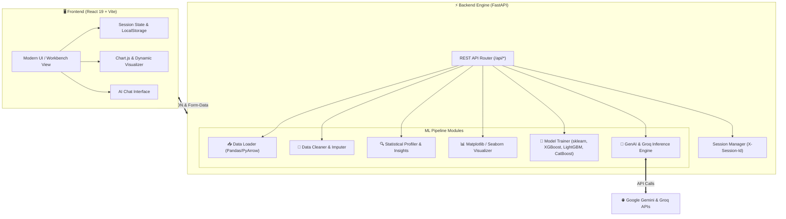

<div align="center">

# ⚡ PipeWise-AI
### *The Intelligent, Full-Stack Machine Learning Workbench & AutoML Platform*

An intuitive, end-to-end Machine Learning pipeline that bridges the gap between raw data and trained AI models. Clean datasets, generate instant statistical visualizations, benchmark multi-class/regression algorithms, and chat with your dataset using LLMs — all from a single unified interface.

<br/>

[](https://fastapi.tiangolo.com)
[](https://react.dev/)
[](https://vitejs.dev/)
[](https://python.org)
[](https://scikit-learn.org)
[](LICENSE)

<br/>

[Quick Start](#-quick-start-3-minutes) •
[Architecture](#-system-architecture) •
[Features](#-core-pipeline-features) •
[API Reference](#-api-endpoints-reference) •
[Project Structure](#-project-structure) •
[Contributing](#-contributing)

---

</div>

## 🌟 Overview

**PipeWise-AI** is designed for software engineers, data scientists, and ML enthusiasts who want a frictionless machine learning lifecycle. It eliminates tedious exploratory boilerplate by combining a high-performance **FastAPI** Python ML engine with a reactive **React 19 + Vite** dashboard.

- **Zero-Config Ingestion:** Drag-and-drop CSV/Excel files or load built-in demo datasets with 1 click.
- **Smart Data Profiler:** Instant schema discovery, missing value ratios, skewness, and Kurtosis metrics.
- **One-Click Imputation:** Automatically resolve nulls, drop corrupted records, and handle outliers.
- **Automated Multi-Model Benchmarking:** Train & compare Random Forest, XGBoost, LightGBM, and CatBoost models side-by-side with automatic train-test splits and evaluation metrics.
- **Conversational Data Intelligence:** Inquire about trends, correlations, or anomalies in plain English using Gemini & Groq LLMs with auto-generated visual charts.
- **Portable Exports:** Download your cleaned datasets and pipeline artifacts in CSV, Excel, or Parquet.

---

## 🏗️ System Architecture



---

## 🚀 Quick Start (3 Minutes)

Follow these concise steps to get PipeWise-AI running on your local machine.

### Prerequisites

| Tool | Recommended Version | Download Link |
| :--- | :--- | :--- |
| **Node.js** | `>= 18.0.0` (npm 9+) | [nodejs.org](https://nodejs.org/) |
| **Python** | `>= 3.9` (3.10 / 3.11 recommended) | [python.org](https://www.python.org/) |
| **Git** | Latest | [git-scm.com](https://git-scm.com/) |

---

### Step 1: Clone the Repository

```bash
git clone https://github.com/SiddharthBarkund/PipeWise-AI.git
cd PipeWise-AI
```

---

### Step 2: Configure & Start Backend

1. Navigate to the `backend` directory:
   ```bash
   cd backend
   ```

2. Create and activate a Python virtual environment:
   - **Windows (PowerShell):**
     ```powershell
     python -m venv .venv
     .venv\Scripts\Activate.ps1
     ```
   - **macOS / Linux:**
     ```bash
     python3 -m venv .venv
     source .venv/bin/activate
     ```

3. Install the dependencies:
   ```bash
   pip install --upgrade pip
   pip install -r requirements.txt
   ```

4. *(Optional for AI Chat)* Create your `.env` file:
   ```bash
   cp .env.example .env
   ```
   Add your API keys inside `backend/.env`:
   ```ini
   GEMINI_API_KEY=your_gemini_api_key_here
   GROQ_API_KEY=your_groq_api_key_here
   ```

5. Launch the FastAPI server:
   ```bash
   python app.py
   ```
   > 🚀 **Backend running at:** `http://localhost:8000`  
   > 📖 **Interactive Swagger UI:** `http://localhost:8000/docs`

---

### Step 3: Start Frontend

Open a new terminal window at the repository root:

1. Navigate to the `frontend` directory:
   ```bash
   cd frontend
   ```

2. Install Node dependencies:
   ```bash
   npm install
   ```

3. Start the Vite development server:
   ```bash
   npm run dev
   ```
   > 🌐 **Application ready at:** `http://localhost:5173`

---

## 🎯 Core Pipeline Features

```
  [1] Upload  ──>  [2] Understand  ──>  [3] Clean  ──>  [4] Visualize
                                                              │
  [8] Export  <──  [7] Insights    <──  [6] AI Chat <── [5] Train
```

| # | Stage | Capabilities |
| :---: | :--- | :--- |
| **1** | **Upload Dataset** | Ingest CSV or Excel files up to 500MB with isolated session tracking. Includes a one-click sample dataset for quick testing. |
| **2** | **Understand Data** | View dataset shape, column types, non-null counts, first 10 preview rows, summary statistics, and missing value percentages. |
| **3** | **Clean Data** | Automated & guided cleaning: drop missing values, impute numeric columns (mean/median/mode), drop redundant columns, and deduplicate records. |
| **4** | **Visualize** | Generate customized plots on the fly: Histograms, Scatter Plots, Box Plots, and Correlation Heatmaps rendered via Matplotlib & Seaborn. |
| **5** | **Train Model** | Auto-detects task type (Classification vs. Regression). Train Random Forest, XGBoost, LightGBM, or CatBoost, or benchmark all algorithms with one click. |
| **6** | **AI Chat** | Query your data in natural language. Powered by Google Gemini and Groq, capable of writing dynamic Pandas queries and returning inline charts. |
| **7** | **Insights** | Deep statistical profiling including Skewness, Kurtosis, distribution anomalies, and automated narrative explanations. |
| **8** | **Export** | Download cleaned datasets in CSV, Excel, or Parquet format for immediate production usage. |

---

## ⚙️ Environment Configuration

PipeWise-AI works out of the box for ML processing and visualization. To enable LLM-powered natural language queries in the AI Chat tab, provide keys in `backend/.env`:

| Key | Required | Description |
| :--- | :---: | :--- |
| `GEMINI_API_KEY` | Optional | Google Gemini API key used for conversational data analysis. |
| `GROQ_API_KEY` | Optional | Groq API key for high-speed Llama-3 inference. |

---

## 📡 API Endpoints Reference

The FastAPI backend exposes standard REST endpoints. Test them interactively at `http://localhost:8000/docs`.

| Method | Endpoint | Description | Request Body / Params |
| :--- | :--- | :--- | :--- |
| `GET` | `/api/health` | Backend status check | *None* |
| `POST` | `/api/upload` | Ingest CSV/Excel dataset | `multipart/form-data` (`file`) |
| `POST` | `/api/upload/demo` | Load built-in demo dataset | *None* |
| `GET` | `/api/understand` | Retrieve schema, summary, and null counts | *None* (Header: `X-Session-Id`) |
| `GET` | `/api/clean/info` | Inspect missing values & duplicates summary | *None* (Header: `X-Session-Id`) |
| `POST` | `/api/clean/apply` | Apply transformation or imputation | `{ action, column, strategy, fillValue }` |
| `POST` | `/api/visualize` | Generate chart image (Base64) | `{ graphType, xColumn, yColumn }` |
| `POST` | `/api/train` | Train single model with metrics & matrices | `{ targetColumn, algorithm, testSize, taskType }` |
| `POST` | `/api/train/compare` | Benchmark all supported ML models | `{ targetColumn, testSize, taskType }` |
| `GET` | `/api/insights` | Fetch statistical insights & metrics | *None* (Header: `X-Session-Id`) |
| `POST` | `/api/chat` | Ask natural language question to AI | `{ question }` |
| `GET` | `/api/export/{fmt}` | Download dataset in specified format | Path param: `csv`, `excel`, or `parquet` |

---

## 📂 Project Structure

```text
PipeWise-AI/
├── backend/                        # Python FastAPI Backend
│   ├── app.py                      # FastAPI application entry point & CORS
│   ├── config.py                   # Server configurations & payload limits
│   ├── requirements.txt            # Python dependencies (scikit-learn, xgboost, etc.)
│   ├── .env.example                # Sample environment variables template
│   ├── routes/                     # Modular API Route Controllers
│   │   ├── upload_routes.py        # Dataset upload & demo loading
│   │   ├── clean_routes.py         # Data cleaning & imputation endpoints
│   │   ├── visualize_routes.py     # Matplotlib/Seaborn visualization generator
│   │   ├── train_routes.py         # Model training & multi-model benchmarking
│   │   ├── insights_routes.py      # Statistical insights & data profiling
│   │   └── chat_routes.py          # AI Chat engine with inline charts
│   ├── ml_engine/                  # Core ML Algorithms & Data Operations
│   │   ├── data_loader.py          # CSV/Excel/Parquet parsing
│   │   ├── data_cleaner.py         # Imputation strategies & deduplication
│   │   ├── model_trainer.py        # ML pipelines (RF, XGB, LGBM, CatBoost)
│   │   ├── stats_engine.py         # Descriptive metrics & distribution checks
│   │   ├── visualizer.py           # Chart generators (Base64 encoding)
│   │   └── chat_engine.py          # LLM integrations (Gemini, Groq)
│   └── utils/                      # Helper utilities
│       └── session_manager.py      # Multi-user session caching
│
├── frontend/                       # React 19 + Vite Frontend
│   ├── package.json                # Frontend dependencies & scripts
│   ├── vite.config.js              # Vite bundler configuration
│   ├── index.html                  # HTML template root
│   └── src/
│       ├── App.jsx                 # Master application controller & navigation
│       ├── main.jsx                # React DOM render entrypoint
│       ├── index.css               # Design system & responsive styles
│       ├── components/             # View Components
│       │   ├── UploadPage.jsx      # File dropzone & demo loader
│       │   ├── UnderstandPage.jsx  # Schema discovery & preview tables
│       │   ├── CleanDataPage.jsx   # Interactive cleaning & imputation forms
│       │   ├── VisualizePage.jsx   # Dynamic chart selector & view
│       │   ├── TrainModelPage.jsx  # Model training dashboard & leaderboards
│       │   ├── AIChatPage.jsx      # Natural language assistant UI
│       │   ├── InsightsPage.jsx    # Advanced statistical summaries
│       │   ├── ExportPage.jsx      # Dataset export actions
│       │   ├── Sidebar.jsx         # Navigation sidebar
│       │   └── TopBar.jsx          # Status indicator & header
│       └── utils/
│           ├── api.js              # Fetch client with session header injection
│           └── auth.js             # Optional Firebase authentication
└── README.md                       # Documentation
```

---

## 🧠 Supported ML Algorithms

PipeWise-AI automatically detects whether your target column is **Classification** or **Regression** and configures appropriate metrics:

| Algorithm | Classification Metrics | Regression Metrics |
| :--- | :--- | :--- |
| **Random Forest** | Accuracy, Precision, Recall, F1, Confusion Matrix, ROC-AUC | RMSE, MAE, R² Score, MSE |
| **XGBoost** | Accuracy, Precision, Recall, F1, Confusion Matrix, ROC-AUC | RMSE, MAE, R² Score, MSE |
| **LightGBM** | Accuracy, Precision, Recall, F1, Confusion Matrix, ROC-AUC | RMSE, MAE, R² Score, MSE |
| **CatBoost** | Accuracy, Precision, Recall, F1, Confusion Matrix, ROC-AUC | RMSE, MAE, R² Score, MSE |
| **Logistic / Linear Regression** | Accuracy, Precision, Recall, F1 | RMSE, MAE, R² Score |

---

## 🛠️ Troubleshooting & FAQ

<details>
<summary><b>1. Backend fails to start with "ModuleNotFoundError"</b></summary>
Ensure your virtual environment is active before starting the server. Run:
```bash
# Verify active python path
which python    # macOS/Linux
where python    # Windows
pip install -r requirements.txt
```
</details>

<details>
<summary><b>2. "CORS error" or Frontend cannot reach Backend</b></summary>
By default, the backend allows all CORS origins in development (`config.py: CORS_ORIGINS = ["*"]`). Ensure the backend is running on port `8000`. You can test connectivity by visiting `http://localhost:8000/api/health` in your browser.
</details>

<details>
<summary><b>3. AI Chat returns "Please provide an API key"</b></summary>
Create a `.env` file inside the `backend/` directory and configure either `GEMINI_API_KEY` or `GROQ_API_KEY`.
</details>

---

## 🤝 Contributing

Contributions make open-source software great! To contribute:

1. **Fork** the Project.
2. **Create** your Feature Branch (`git checkout -b feature/AmazingFeature`).
3. **Commit** your Changes (`git commit -m 'feat: Add AmazingFeature'`).
4. **Push** to the Branch (`git push origin feature/AmazingFeature`).
5. **Open** a Pull Request.

---

## 📄 License

Distributed under the **MIT License**. See [`LICENSE`](LICENSE) for complete terms.

<div align="center">
  <sub>Built with ❤️ by Siddharth Barkund • Empowering developers with rapid AutoML workflows</sub>
</div>
